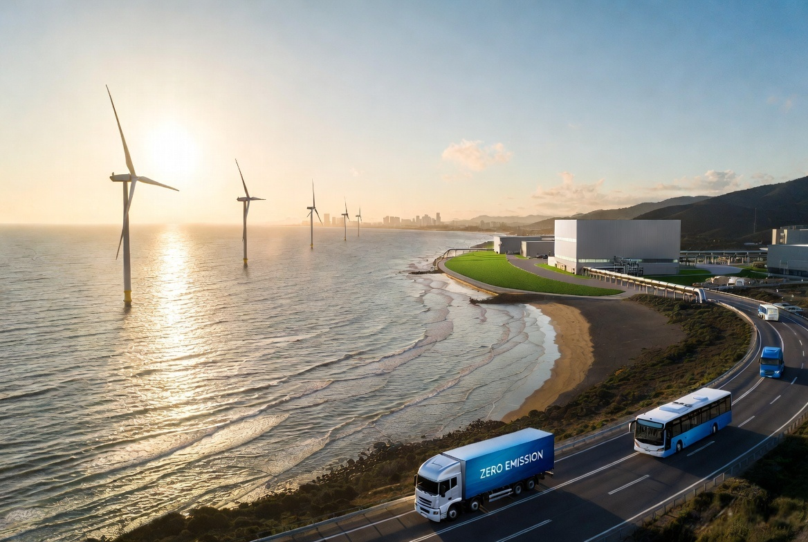
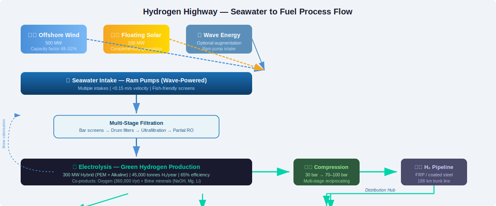
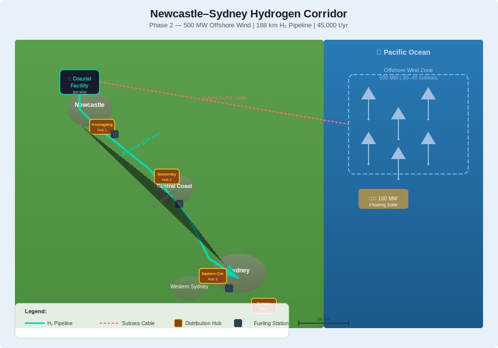
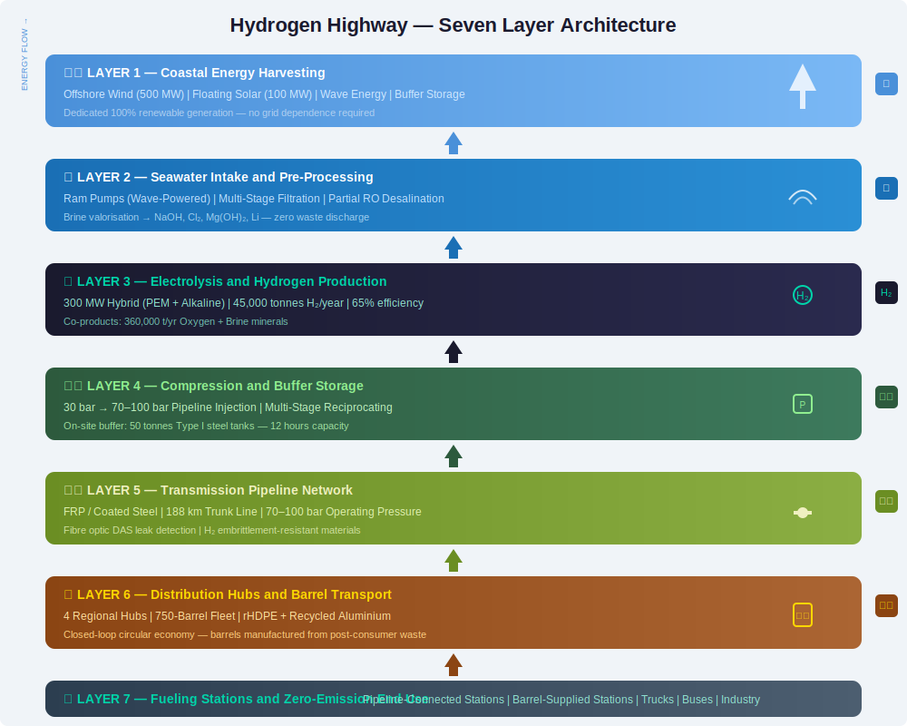

# 🌊💨 Hydrogen Highway

> *"What if every coastline was a fuel station, every ocean breeze a refinery, and every vehicle ran on water and wind?"*




---

**Hydrogen Highway** is an open infrastructure blueprint for a fully integrated, coastal green hydrogen production and distribution network. The system harnesses offshore wind, floating solar, and wave energy to convert seawater into clean hydrogen fuel through electrolysis — then delivers that fuel inland via a dedicated pipeline network and a circular-economy transport system built from recycled materials.

No carbon. No fossil feedstock. No toxic tailpipe emissions. Just water, wind, and sun — converted into fuel that powers transport, industry, and energy storage at civilisation scale.

---

## Table of Contents

- [The Core Idea](#the-core-idea)
- [The Case for Acting Now](#the-case-for-acting-now)
- [The Newcastle–Sydney Calculation](#the-newcastlesydney-calculation)
- [System Architecture — Seven Layers](#system-architecture--seven-layers)
  - [Layer 1 — Coastal Energy Harvesting](#layer-1--coastal-energy-harvesting)
  - [Layer 2 — Seawater Intake and Pre-Processing](#layer-2--seawater-intake-and-pre-processing)
  - [Layer 3 — Electrolysis and Hydrogen Production](#layer-3--electrolysis-and-hydrogen-production)
  - [Layer 4 — Transmission Pipeline Network](#layer-4--transmission-pipeline-network)
  - [Layer 5 — Inland Distribution Hubs](#layer-5--inland-distribution-hubs)
  - [Layer 6 — Recycled Material Storage and Transport](#layer-6--recycled-material-storage-and-transport)
  - [Layer 7 — Fueling Stations and End-Use Interface](#layer-7--fueling-stations-and-end-use-interface)
- [Economic Model — Full Lifecycle](#economic-model--full-lifecycle)
- [Safety Architecture](#safety-architecture)
- [Rollout Phases](#rollout-phases)
- [Technology Readiness Assessment](#technology-readiness-assessment)
- [Impact Summary](#impact-summary)
- [Contributing](#contributing)
- [Licence](#licence)
- [Inventor](#inventor)

---

## The Core Idea

The world's coastlines receive the most consistent, powerful winds on the planet. Offshore wind capacity factors routinely exceed 50% — far better than onshore. Yet most of this energy potential remains untapped, and when it is captured, the challenge becomes: how do you move terawatt-hours of energy from remote coastlines to where people actually live?

**Hydrogen answers that question.**

By co-locating electrolysis directly at the coast, we convert intermittent renewable electricity into storable, transportable hydrogen fuel. A pipeline network — engineered specifically for hydrogen's unique properties — carries that fuel inland to distribution hubs and fueling stations. For locations beyond the pipeline reach, a fleet of reusable transport barrels manufactured from recycled HDPE plastic and recycled aluminium provides the last-mile solution.

Every component of this system already exists. Offshore wind is mature. Electrolysis is scaling rapidly. Hydrogen pipelines operate today. Recycled plastic and aluminium manufacturing is established industry. The innovation is in integration, siting, and the circular material economy that closes the loop from production to consumption and back.

**This is not speculative. It is inevitable. The only question is who builds it first, and at what scale.**


*Sankey-style flow diagram showing seawater intake → filtration → desalination → electrolysis → compression → pipeline/barrel transport → fueling station → vehicle.*

---

## The Case for Acting Now

Transport accounts for approximately **8 billion tonnes of CO₂ annually — 24% of global emissions**. Heavy transport — trucks, buses, ships, trains — is the hardest sector to electrify with batteries alone. Weight, range, and refueling time all favour hydrogen for long-haul and heavy-duty applications.

Meanwhile, the cost of offshore wind has fallen by over 70% in the past decade. Electrolyser costs are on a similar trajectory, with manufacturing capacity doubling every 18–24 months. Green hydrogen production cost is projected to reach parity with fossil-derived hydrogen (grey/blue) by 2030, and parity with diesel in heavy transport applications by 2035.

The infrastructure decisions we make in the next decade will determine transport emissions for the next fifty years. Building more fossil fuel stations locks in carbon for their operational lifetime. Building hydrogen-ready infrastructure now — even if initially serving industrial demand — creates the foundation for a zero-carbon transport future.

Continuing to invest in petrol and diesel infrastructure is not pragmatism. It is deferring an inevitable transition at growing environmental and economic cost.

---

## The Newcastle–Sydney Calculation

To illustrate the potential scale, consider a single coastal production facility serving the Newcastle–Sydney corridor in Australia.

**Facility parameters (Phase 2 / Corridor scale):**

| Parameter | Value |
|---|---|
| Offshore wind capacity | 500 MW (approximately 30–40 turbines at 12–15 MW each) |
| Co-located floating solar | 100 MW |
| Electrolyser capacity | 300 MW (PEM + alkaline hybrid) |
| Annual hydrogen production | ~45,000 tonnes |

**Demand scenarios:**

| Use case | Annual H₂ per unit | Vehicles supported |
|---|---|---|
| Heavy trucks (long haul) | 3,000 kg | 15,000 trucks |
| Municipal buses | 12,000 kg | 3,750 buses |
| Light commercial (vans) | 500 kg | 90,000 vans |
| Passenger cars | 150 kg | 300,000 cars |
| Industrial offtake (ammonia/steel) | n/a | 45,000 tonnes direct |

**CO₂ avoidance:**

- 45,000 tonnes H₂ replacing diesel in heavy trucks = **~350,000 tonnes CO₂ avoided annually**
- Replacing grey hydrogen in ammonia production = **~450,000 tonnes CO₂ avoided annually**

**Water consumption:**

- Electrolysis requires ~9 litres of water per kg of hydrogen
- 45,000 tonnes H₂ = 405,000 m³ water per year
- Equivalent to ~160 Olympic swimming pools annually
- Seawater source is effectively unlimited

**Economic value at maturity (2035 pricing target):**

| Metric | Value |
|---|---|
| Production cost | $2.50/kg H₂ |
| Wholesale price | $4.00/kg H₂ |
| Annual revenue | $180 million |
| Capital cost (wind + electrolysis + pipeline) | ~$1.2 billion |
| Simple payback (excluding incentives) | ~8–10 years |


*Map showing offshore wind area off Newcastle coast, coastal electrolysis facility at Kooragang Island, pipeline route following M1 corridor south to Sydney, distribution hubs at Central Coast and Western Sydney.*

---

## System Architecture — Seven Layers


*Exploded isometric diagram showing all seven layers from offshore wind down to end-use vehicles.*

---

### Layer 1 — Coastal Energy Harvesting

#### Offshore wind farms (primary energy source)

Fixed-bottom turbines in water depths up to 60 metres. Floating platforms beyond that. Modern turbines rated 12–18 MW each, with capacity factors of 45–60% in good offshore wind regimes. Direct electrical connection to onshore electrolysis facility via subsea high-voltage cables. No grid connection required if dedicated to hydrogen production — the electrolyser is the load.

| Parameter | Value (Phase 2 scale) |
|---|---|
| Capacity | 500 MW |
| Turbines | 30–40 units (12–15 MW each) |
| Water depth | 30–50m (Newcastle Bight) |
| Distance to shore | 10–25 km |
| Capacity factor | 48–52% (Newcastle wind resource) |
| Annual generation | ~2,200 GWh |
| Subsea cable | 220 kV HVAC or HVDC |

#### Co-located floating solar

Solar PV arrays on floating platforms installed between turbine foundations. Provides complementary generation profile — peaks midday when wind often dips. Combined wind+solar capacity factor can exceed 65%.

| Parameter | Value |
|---|---|
| Capacity | 100 MW |
| Platform type | Floating HDPE pontoon array |
| Capacity factor | 18–22% |
| Annual generation | ~175 GWh |
| Synergy | Shared subsea cable infrastructure |

#### Wave energy augmentation (optional, future phase)

Point-absorber buoys or oscillating water columns integrated into turbine foundations. Lower energy density than wind but highly predictable 24/7 baseline output. Helps smooth the generation troughs when both wind and solar are low. Not required for initial deployment but offers ~5–10% additional annual energy.

#### Energy storage buffer at coast

Electrolysers prefer stable input. A buffer storage system decouples intermittent generation from continuous hydrogen production.

| Technology | Capacity | Function |
|---|---|---|
| Lithium-ion BESS | 50 MW / 100 MWh | Short-term smoothing (seconds to minutes) |
| Flow battery (vanadium) | 20 MW / 200 MWh | Longer-duration shifting (hours) |
| Hydrogen buffer tanks | 10 tonnes H₂ | Absorb electrolyser output fluctuations |

All energy input is 100% renewable, zero-carbon, dedicated green generation.

---

### Layer 2 — Seawater Intake and Pre-Processing

#### Ram pump intake system

Wave-powered or hydraulic ram pumps use ocean energy to lift seawater to the coastal facility without external electricity. Passive, low-maintenance, operates continuously as long as waves exist. Multiple intake points with coarse screens to exclude marine life and debris. Redundant intakes spaced along coast — if one fails or is blocked, others maintain full flow.

| Parameter | Value |
|---|---|
| Intake depth | 5–10m below surface |
| Intake velocity | <0.15 m/s (prevents fish entrainment) |
| Capacity | 5,000 m³/day (Phase 2) |
| Pump type | Wave-actuated ram pump array |
| Energy source | Wave motion only — zero grid power |

#### Multi-stage filtration cascade

| Stage | Technology | Removes | Output quality |
|---|---|---|---|
| 1 | Coarse bar screens (10mm) | Large debris, marine organisms | — |
| 2 | Drum filters (200μm) | Sand, silt, suspended solids | — |
| 3 | Ultrafiltration membranes | Bacteria, microplastics, colloids | Turbidity <0.1 NTU |
| 4 | Reverse osmosis (partial) | Dissolved salts | <500 ppm TDS |
| 4 alt | Direct seawater electrolysis | n/a (emerging tech) | Seawater direct |

#### Reverse osmosis configuration

Standard seawater RO operates at 50–70 bar and achieves 99.5% salt rejection. For electrolysis feed, partial RO is sufficient — we don't need drinking-water purity, just low enough conductivity to prevent electrode degradation. This reduces RO energy consumption by 30–40% compared to full desalination.

| Parameter | Value |
|---|---|
| Recovery rate | 40–50% |
| Energy consumption | 2.5–3.0 kWh/m³ |
| Feed to electrolysis | <500 μS/cm conductivity |
| RO membranes | Polyamide thin-film composite |

#### Brine valorisation — converting waste to resource

Conventional desalination discharges concentrated brine back to the ocean, creating local salinity spikes harmful to marine life. This system treats brine as a resource stream, not waste.

| Product | Process | Market value |
|---|---|---|
| Sodium hydroxide (NaOH) | Chlor-alkali electrolysis of brine | $300–600/tonne — industrial chemical |
| Chlorine (Cl₂) | Co-product of NaOH production | $200–400/tonne — water treatment |
| Magnesium hydroxide | Precipitation with lime/dolomite | $500–1,000/tonne — refractory, agricultural |
| Industrial salt (NaCl) | Evaporative crystallisation | $50–100/tonne — chemical feedstock |
| Lithium (if present) | Selective adsorption or solvent extraction | $15,000–25,000/tonne — batteries |
| Bromine | Chlorine oxidation and steam stripping | $3,000–5,000/tonne — flame retardants |

For a 45,000 tonne/year hydrogen facility, brine stream is approximately 550,000 m³/year at 70,000 ppm TDS — containing roughly 38,500 tonnes of dissolved salts annually. Valorising even 30% of this stream creates a significant secondary revenue source while eliminating marine discharge impacts.

#### Marine biology protection measures

- Intake screens with 2mm slot width, angled to encourage fish escape
- Underwater acoustic deterrents (low-frequency pulsed sound) guiding fish away
- Slow intake velocity (<0.15 m/s) prevents larval entrainment
- Regular automated backflushing of intake screens
- Diffused discharge for any return water ensuring 1,000:1 dilution within 50m

---

### Layer 3 — Electrolysis and Hydrogen Production

#### Electrolyser technology selection

| Technology | Efficiency (HHV) | Water requirement | Ramp rate | Maturity | Capex (2026) | Best use |
|---|---|---|---|---|---|---|
| PEM | 65–75% | Ultra-pure | Seconds | Commercial | $800–1,200/kW | Variable renewable load |
| Alkaline | 60–70% | Purified | Minutes | Mature | $500–800/kW | Steady baseload |
| Solid Oxide (SOEC) | 80–90% | Steam | Hours | Demo | $1,500–2,500/kW | Waste heat integration |
| AEM | 60–70% | Purified | Seconds | Early commercial | $600–900/kW | Lower cost, no PGMs |
| Direct seawater | 50–60% | Seawater direct | Seconds | Lab/pilot | TBD | Eliminates desalination |

#### Recommended hybrid configuration — Phase 2 Corridor scale

| Component | Technology | Capacity | Function |
|---|---|---|---|
| Primary electrolyser | PEM | 200 MW | Load-following — ramps with wind/solar |
| Baseload electrolyser | Alkaline | 100 MW | Steady operation from buffered power |
| **Total** | **Hybrid** | **300 MW** | **Optimised capex/efficiency/flexibility** |

**Why hybrid?**

- PEM handles the variability — ramps from 0–100% in seconds without degradation
- Alkaline provides cost-effective baseload production from stored/buffered energy
- Combined system achieves higher overall utilisation than either technology alone
- Future SOEC addition if co-located with industrial heat source

#### Hydrogen production calculation

| Parameter | Value |
|---|---|
| Electrolyser capacity | 300 MW |
| Annual operating hours (equiv. full load) | 5,500 hours |
| System efficiency (HHV, including compression) | 65% |
| Annual H₂ production | ~45,000 tonnes |
| Production rate (peak) | 6.7 tonnes/hour |
| Production rate (average) | 5.1 tonnes/hour |

#### Oxygen co-product capture

Electrolysis produces 8 kg of oxygen for every 1 kg of hydrogen. At 45,000 tonnes H₂/year, that's 360,000 tonnes of pure oxygen annually — currently vented to atmosphere in most facilities.

| Oxygen use | Value |
|---|---|
| Wastewater treatment aeration | $30–60/tonne |
| Medical oxygen (post-purification) | $100–200/tonne |
| Steel manufacturing (basic oxygen furnace) | $40–80/tonne |
| Oxy-fuel combustion (industrial heat) | $30–50/tonne |
| Rocket propellant (if liquefied) | $200–400/tonne |

Capture and liquefaction adds capital cost but creates secondary revenue of $10–30 million annually at scale.

#### Compression and initial storage

| Stage | Pressure | Technology |
|---|---|---|
| Electrolyser outlet | 20–30 bar | Direct from stack |
| Intermediate buffer | 30 bar | Type I steel tanks (50 tonnes capacity) |
| Pipeline injection | 70–100 bar | Multi-stage reciprocating compressor |
| Compressor power | ~3–4 kWh/kg H₂ | Powered by on-site renewable energy |

**On-site hydrogen storage buffer:**

- 50 tonnes working capacity (approximately 12 hours of production)
- Type I welded steel pressure vessels (lowest cost for stationary bulk storage)
- Allows pipeline maintenance without curtailing electrolyser
- Provides emergency reserve for critical offtake customers

---

### Layer 4 — Transmission Pipeline Network

#### The hydrogen embrittlement problem

Hydrogen is the smallest molecule in existence. It diffuses into steel, reacts with carbon to form methane, creates internal pressure voids, and causes catastrophic brittle fracture. Most existing natural gas pipelines are **not compatible** with pure hydrogen at transmission pressures.

| Material | H₂ compatibility | Mechanism |
|---|---|---|
| Carbon steel (API 5L X42–X70) | Poor — embrittlement | H atoms → methane at grain boundaries |
| Low-alloy steel with coating | Good (with intact coating) | Coating blocks H₂ diffusion |
| Austenitic stainless steel (316L) | Excellent | Face-centred cubic structure resists H₂ |
| Fibre-reinforced polymer (FRP) | Excellent | Non-metallic, no embrittlement |
| Polyethylene (HDPE) | Excellent | Non-metallic; pressure-limited |
| Lined steel (retrofit) | Excellent | HDPE liner blocks H₂ from steel wall |

#### Recommended pipeline specification — new construction

| Parameter | Specification |
|---|---|
| Material | Glass-fibre reinforced polymer (GFRP) or coated low-alloy steel |
| Diameter | 400–600 mm (16–24 inch) |
| Wall thickness | 15–25 mm (design factor 0.5 per ASME B31.12) |
| Operating pressure | 70–100 bar |
| Depth of cover | 1.5–2.0 m |
| Design life | 50+ years |
| Leak detection | Fibre optic distributed acoustic sensing (DAS) in trench |
| Corrosion protection | Cathodic protection (if steel); FRP inherently immune |

#### Pipeline routing — Newcastle to Sydney corridor

| Segment | Length | Terrain | Notes |
|---|---|---|---|
| Coastal facility to M1 corridor | 8 km | Industrial | Follows existing utility easement |
| M1 corridor (Newcastle to Wahroonga) | 120 km | Highway median/verge | State road reserve — reduced land acquisition |
| Wahroonga to Western Sydney hub | 25 km | Urban fringe | Tunnel or directional drill under sensitive areas |
| Western Sydney hub to Port Botany | 35 km | Industrial corridor | Existing gas ROW available |
| **Total trunk line** | **~188 km** | | |

#### Pipeline cost estimate (Phase 2 corridor)

| Component | Unit cost | Total (188 km) |
|---|---|---|
| FRP pipe (600mm, manufactured) | $800–1,200/m | $150–225 million |
| Trenching and installation | $400–600/m | $75–110 million |
| Fibre optic sensing system | $50–100/m | $9–19 million |
| Valves, pigging stations, cathodic protection | Lump sum | $15–25 million |
| Compressor stations (3 locations) | $8–12 million each | $24–36 million |
| Engineering, permitting, contingency (30%) | | $80–120 million |
| **Total pipeline CAPEX** | | **$350–535 million** |

#### Retrofit opportunity — existing gas pipeline reuse

Where existing natural gas pipelines exist along the corridor, HDPE liner insertion can convert them to hydrogen service at 40–60% of new-build cost. Liner is pulled through existing pipe, grouted in place, creating a hydrogen-tight barrier while preserving the steel pipe's structural strength and existing right-of-way.

| Retrofit parameter | Value |
|---|---|
| Suitable existing pipeline length (est.) | 60–80 km |
| Retrofit cost vs new build | 40–60% |
| Technical limitation | Reduced diameter (liner takes internal space) |
| Pressure rating maintained | Yes (liner is pressure-containing) |

#### Pipeline capacity

| Parameter | Value |
|---|---|
| Diameter | 600 mm (24 inch) |
| Operating pressure | 70 bar |
| Flow velocity (max) | 15 m/s |
| Hydrogen capacity | ~500,000 tonnes/year |
| Phase 2 utilisation | ~9% of capacity (45,000 tonnes) |
| Phase 3–4 headroom | Substantial — scale production without new pipeline |

The pipeline is intentionally oversized for Phase 2. This is forward infrastructure — build once for the next 30 years of production growth, not for initial demand.

---

### Layer 5 — Inland Distribution Hubs

Distribution hubs are located at strategic points along the pipeline where hydrogen is off-taken, purified if needed, compressed to dispensing pressure, and either dispensed directly to vehicles or loaded into transport barrels for last-mile delivery.

**Hub site selection criteria:**

- Pipeline proximity (<5 km lateral from trunk line)
- Major transport corridor intersection
- Industrial zoning (simplifies permitting)
- Space for truck manoeuvring and barrel storage
- Grid connection for ancillary power (or on-site fuel cell)
- Expansion area for future fueling lanes

#### Newcastle–Sydney corridor hub locations (Phase 2)

| Hub | Location | Function |
|---|---|---|
| Coastal Production Hub | Kooragang Island, Newcastle | Primary production, pipeline injection, initial distribution, barrel filling |
| Central Coast Hub | Somersby / West Gosford | Pipeline offtake, truck fueling, barrel distribution north of Sydney |
| Western Sydney Hub | Eastern Creek / Arndell Park | Major distribution centre, barrel filling, heavy vehicle fueling |
| Port Botany Hub | Banksmeadow | Marine fueling, export terminal (future), industrial offtake |

#### Hub facility specification — Western Sydney Hub example

| Component | Specification |
|---|---|
| Pipeline offtake | 100 bar inlet, pressure reduction station |
| Purification | PSA (pressure swing adsorption) to 99.97% purity |
| Compression | 350 bar (heavy vehicles) and 700 bar (light vehicles) |
| Cascade storage | Type IV composite tanks, 2,000 kg total working capacity |
| Dispensing lanes | 4 lanes (2 × 350 bar, 2 × 700 bar) |
| Barrel filling station | 4 simultaneous barrel fill positions |
| Barrel storage yard | 500 barrel capacity (full and empty) |
| On-site power | 500 kW hydrogen fuel cell (self-powered) |
| Solar canopy | 250 kW rooftop solar over barrel storage |
| Site area | ~2 hectares |

#### Barrel filling process

| Step | Description | Time |
|---|---|---|
| 1 | Empty barrel arrives from station / customer | — |
| 2 | Visual inspection and valve test | 2 min |
| 3 | Residual pressure check / purge with nitrogen | 1 min |
| 4 | Connect to filling manifold | 1 min |
| 5 | Fill to 350 or 500 bar | 5–8 min |
| 6 | Leak test (sniffer or soap bubble) | 1 min |
| 7 | Seal, label, record in tracking system | 1 min |
| 8 | Load onto transport truck | — |
| **Total per barrel** | | **~12 minutes** |

---

### Layer 6 — Recycled Material Storage and Transport

This is the circular economy core of the system. Instead of single-use or virgin-material transport vessels, hydrogen is distributed via a fleet of reusable barrels manufactured from post-consumer recycled HDPE plastic and recycled aluminium.

#### The barrel design

| Component | Material | Source | Function |
|---|---|---|---|
| Outer shell | rHDPE (recycled HDPE) | Post-consumer bottles, packaging | Structural container, impact protection |
| Inner liner | Recycled aluminium | Post-consumer cans, scrap | Zero-permeation hydrogen barrier |
| Boss / valve fittings | Stainless steel 316L | Recycled or virgin | High-pressure connection point |
| Valve assembly | Stainless steel + EPDM/Viton | Virgin (safety-critical) | Fill/dispense control |
| Protective collar | rHDPE | Recycled | Valve protection during handling |
| Chime rings | rHDPE or recycled steel | Recycled | Rolling/stacking stability |

#### Why the aluminium liner is essential

HDPE alone is permeable to hydrogen. Over days to weeks, hydrogen molecules diffuse through the polymer wall. This is acceptable for very short-term transport but not for storage beyond 24–48 hours. The aluminium liner provides:

| Property | Benefit |
|---|---|
| Zero hydrogen permeation | No loss, no safety hazard from accumulation |
| Structural strength | Shares pressure load with HDPE shell |
| Thermal conductivity | Dissipates heat during fast filling |
| Recyclability | Aluminium is infinitely recyclable without degradation |
| Weight reduction | Lighter than all-steel Type I cylinders |

#### Barrel specifications

| Parameter | Type A (Standard) | Type B (Extended Range) |
|---|---|---|
| Water volume | 200 L | 450 L |
| H₂ capacity at 350 bar | 4.8 kg | 10.8 kg |
| H₂ capacity at 500 bar | 6.6 kg | 14.8 kg |
| Empty weight | ~45 kg | ~90 kg |
| Full weight (350 bar) | ~50 kg | ~101 kg |
| Dimensions (L × D) | 1,200 × 450 mm | 1,500 × 650 mm |
| Design life | 15 years | 15 years |
| Recertification interval | 5 years | 5 years |
| End-of-life | Shred, separate, remanufacture | Shred, separate, remanufacture |

#### Barrel fleet size calculation — Western Sydney Hub service area

| Parameter | Value |
|---|---|
| Service radius | 150 km |
| Stations served | 15 fueling stations |
| Average station daily demand (Phase 2) | 200 kg/day |
| Total daily demand | 3,000 kg/day |
| Barrels in transit (full) | 200 barrels (Type B, 500 bar) |
| Barrels at stations (emptying) | 150 barrels |
| Barrels in transit (empty return) | 200 barrels |
| Barrels at hub (filling/staging) | 150 barrels |
| Barrels in maintenance/recert | 50 barrels |
| **Total fleet required** | **~750 barrels** |

#### Barrel lifecycle and circular economy

```
    POST-CONSUMER WASTE
           │
    ┌──────┴──────┐
    ▼             ▼
┌─────────┐  ┌─────────┐
│ Al cans │  │HDPE     │
│ scrap   │  │bottles  │
└────┬────┘  └────┬────┘
     │            │
     ▼            ▼
  Melt, cast   Shred, wash,
  into liners  pelletise
     │            │
     └─────┬──────┘
           ▼
    ┌─────────────┐
    │ MANUFACTURE │
    │   BARREL    │
    └──────┬──────┘
           │
           ▼
    ┌─────────────┐
    │ FILL AT HUB │ ◄─── Green H₂ from pipeline
    └──────┬──────┘
           │
           ▼
    ┌─────────────┐
    │  TRANSPORT  │
    │ TO STATION  │
    └──────┬──────┘
           │
           ▼
    ┌─────────────┐
    │  DISPENSE   │
    │ TO VEHICLES │
    └──────┬──────┘
           │
           ▼
    ┌─────────────┐
    │ RETURN      │
    │ EMPTY       │
    └──────┬──────┘
           │
    ┌──────┴──────┐
    ▼             ▼
 INSPECT        REPAIR
 PASS?          (minor)
    │             │
    ▼             │
 REFILL ◄─────────┘
 (80% of fleet)
    │
    │ (after 15 years / 3 recert cycles)
    ▼
 END OF LIFE
    │
    ▼
 SEPARATE MATERIALS
    │
    └──► BACK TO MANUFACTURING
```

#### Material recovery metrics

| Material | Mass per barrel | Recovery rate | Recycled content in new barrel |
|---|---|---|---|
| rHDPE shell | 35 kg (Type B) | 98% | 100% (closed loop) |
| Aluminium liner | 12 kg | 99% | 100% (closed loop) |
| Stainless steel fittings | 3 kg | 99% | 80% (some virgin required) |
| Seals / O-rings | 0.2 kg | 0% (replaced) | Virgin only |

#### Transport logistics

Barrels are transported on standard flatbed trucks with barrel racks — similar to beer keg or gas cylinder distribution. A single truck carries 40–60 Type B barrels, delivering 400–600 kg of hydrogen per trip.

| Parameter | Value |
|---|---|
| Truck type | Diesel (transition) → Hydrogen fuel cell |
| Barrels per truck | 48 Type B |
| H₂ delivered per trip | ~500 kg |
| Trips per day (Western Sydney hub) | 6–8 trips |
| Fleet vehicles required | 4–6 trucks |
| Delivery cost per kg H₂ | $0.15–0.25 (labour + vehicle + amortisation) |

---

### Layer 7 — Fueling Stations and End-Use Interface

#### Station types

| Type | Location | Capacity | Function |
|---|---|---|---|
| Pipeline-connected | Along trunk line corridor | 1,000–2,000 kg/day | Direct offtake, no barrel delivery |
| Hub-based | At distribution hub | 2,000–4,000 kg/day | Co-located with barrel filling |
| Barrel-supplied (satellite) | Remote from pipeline | 100–500 kg/day | Receives barrel deliveries |
| Mobile / temporary | Construction, events | 50–200 kg/day | Self-contained, trailer-mounted |

#### Pipeline-connected station specification

| Component | Specification |
|---|---|
| Pipeline offtake | 100 bar → pressure reduction |
| Purification | PSA to 99.97% |
| Compression | 350 bar and 700 bar streams |
| Cascade storage | Type IV composite, 800 kg @ 350 bar, 400 kg @ 700 bar |
| Pre-cooling | −40°C for 700 bar fast fill |
| Dispensers | 4 × dual-pressure (350/700 bar) |
| Canopy solar | 100 kW rooftop |
| On-site fuel cell | 100 kW backup/auxiliary power |
| Site area | 1,500–2,500 m² |

#### Barrel-supplied station specification

| Component | Specification |
|---|---|
| Barrel receiving bay | Manifold connection to 4–8 barrels simultaneously |
| Cascade storage | Type IV composite, 200–400 kg total |
| Booster compressor | For 700 bar dispensing (if barrels at 350 bar) |
| Dispensers | 2 × dual-pressure |
| Barrel storage | Secure rack for 20–40 barrels (full and empty) |
| Solar canopy | 50 kW |
| On-site fuel cell | 50 kW backup |
| Site area | 800–1,500 m² |

#### Fueling protocol (SAE J2601 compliant)

| Vehicle type | Pressure | Fill time | H₂ per fill | Range |
|---|---|---|---|---|
| Passenger car (Toyota Mirai, Hyundai Nexo) | 700 bar | 3–5 min | 5–6 kg | 600–800 km |
| Light commercial van | 700 bar | 4–6 min | 8–10 kg | 400–600 km |
| Bus (city) | 350 bar | 8–12 min | 30–40 kg | 350–450 km |
| Heavy truck (long haul) | 350 bar | 10–15 min | 60–80 kg | 800–1,000 km |
| Forklift / material handling | 350 bar | 2–3 min | 1–2 kg | 8–10 hours operation |

#### Retrofit pathway for existing petrol stations

Existing petrol station sites can be converted to hydrogen fueling, often while maintaining some petrol/diesel pumps during transition.

| Step | Action | Timeline |
|---|---|---|
| 1 | Site assessment — safety distances, local regulations | 1–2 months |
| 2 | Remove underground petrol tanks (if end-of-life) or leave decommissioned | 2–4 months |
| 3 | Install hydrogen cascade storage (above or below ground) | 2–3 months |
| 4 | Install hydrogen dispensers (can share island with petrol) | 1–2 months |
| 5 | Hydrogen detection, ventilation, safety systems | 1–2 months |
| 6 | Commissioning and operator training | 1 month |
| **Total conversion time** | | **6–12 months** |

#### Multi-fuel energy hub concept

Future fueling stations are not single-fuel. A single site serves:

| Fuel type | Dispensers | Users |
|---|---|---|
| Hydrogen — 700 bar | 2–4 | Cars, vans |
| Hydrogen — 350 bar | 2 | Trucks, buses |
| EV fast charging | 4–8 stalls (150–350 kW) | Cars, vans, trucks |
| Petrol / Diesel | 2–4 (legacy, decreasing) | Transitional vehicles |
| Revenue diversification | Convenience store, café, driver amenities | All customers |

The station becomes a **transport energy hub**, not a single-fuel outlet.

---

## Economic Model — Full Lifecycle

### Capital Expenditure (CAPEX) — Phase 2 Corridor

*(500 MW wind, 45,000 t H₂/year)*

**Generation:**

| Component | Cost range | Midpoint |
|---|---|---|
| Offshore wind (500 MW) | $1,500–2,200/kW | $925 million |
| Floating solar (100 MW) | $800–1,200/kW | $100 million |
| Subsea cables and grid connection | $80–120 million | $100 million |
| Onshore substation / BESS buffer | $40–60 million | $50 million |
| **Generation subtotal** | | **$1,175 million** |

**Production:**

| Component | Cost range | Midpoint |
|---|---|---|
| Electrolysers (300 MW PEM + alkaline) | $700–1,000/kW | $255 million |
| Desalination / water treatment | $15–25 million | $20 million |
| Brine valorisation plant | $30–50 million | $40 million |
| Oxygen capture and liquefaction | $15–25 million | $20 million |
| Compression and buffer storage | $25–40 million | $32 million |
| Civil works, buildings, balance of plant | $80–120 million | $100 million |
| **Production subtotal** | | **$467 million** |

**Pipeline (188 km trunk line):**

| Component | Cost range | Midpoint |
|---|---|---|
| Pipeline materials and installation | $350–535 million | $440 million |

**Distribution:**

| Component | Cost range | Midpoint |
|---|---|---|
| Distribution hubs (3 locations) | $25–40 million each | $100 million |
| Pipeline-connected stations (4) | $3–5 million each | $16 million |
| Barrel-supplied stations (15) | $1.5–2.5 million each | $30 million |
| Barrel fleet (750 units) | $3,000–4,000 each | $2.6 million |
| Transport trucks (6) | $300,000–500,000 each | $2.4 million |
| **Distribution subtotal** | | **$151 million** |

| | |
|---|---|
| Engineering, permitting, contingency (25%) | $558 million |
| **TOTAL PHASE 2 CAPEX** | **~$2.8 billion** |

### Operating Expenditure (OPEX) — Annual

**Generation:**

| Category | Cost range | Midpoint |
|---|---|---|
| Offshore wind O&M | $40–60/kW/year | $25 million |
| Floating solar O&M | $15–25/kW/year | $2 million |
| **Generation subtotal** | | **$27 million** |

**Production:**

| Category | Cost range | Midpoint |
|---|---|---|
| Electrolyser stack replacement (10–15% per year) | | $18 million |
| Desalination membrane replacement | | $2 million |
| General plant O&M (labour, maintenance) | | $15 million |
| Electricity for auxiliaries (from grid or self-generated) | | $5 million |
| **Production subtotal** | | **$40 million** |

**Pipeline and distribution:**

| Category | Cost range | Midpoint |
|---|---|---|
| Pipeline O&M | $5,000–10,000/km/year | $1.5 million |
| Hub and station O&M | | $8 million |
| Barrel fleet maintenance / recertification | | $1 million |
| Transport logistics (labour, vehicle fuel) | | $3 million |
| **Distribution subtotal** | | **$13.5 million** |

| | |
|---|---|
| **TOTAL ANNUAL OPEX** | **~$80 million** |

### Revenue Streams

| Revenue source | Volume | Unit price (2035 target) | Annual revenue |
|---|---|---|---|
| Hydrogen sales — transport | 30,000 tonnes | $4.00/kg | $120 million |
| Hydrogen sales — industrial | 15,000 tonnes | $3.50/kg (contract) | $52.5 million |
| Oxygen sales | 200,000 tonnes | $40/tonne | $8 million |
| Brine products (NaOH, salt, Mg) | Various | Various | $15 million |
| Grid services (BESS) | 100 MWh capacity | $50,000/MW-year | $2.5 million |
| **TOTAL ANNUAL REVENUE** | | | **~$198 million** |

### Financial Metrics

| Metric | Value |
|---|---|
| Total CAPEX | $2.8 billion |
| Annual OPEX | $80 million |
| Annual revenue | $198 million |
| EBITDA | $118 million |
| Depreciation (25-year straight line) | $112 million |
| EBIT | $6 million |
| Simple payback (undiscounted) | ~24 years |
| With incentives / carbon credits | 12–15 years |

**Incentives that improve economics:**

| Mechanism | Impact |
|---|---|
| Hydrogen Production Tax Credit (US IRA equivalent) | $1.00–3.00/kg → +$45–135M/year |
| Carbon credits ($50/tonne CO₂ avoided) | 350,000 tonnes → +$17.5M/year |
| Accelerated depreciation | Improved after-tax cashflow |
| Green bond financing | Lower cost of capital |
| Government co-investment in pipeline | Reduced upfront CAPEX |

With full incentive stack (2030–2035), simple payback improves to **8–12 years** — competitive with conventional energy infrastructure.

### Cost Trajectory to 2050

| Component | 2026 | 2030 | 2035 | 2040 | 2050 |
|---|---|---|---|---|---|
| Offshore wind CAPEX ($/kW) | 1,800 | 1,400 | 1,100 | 900 | 700 |
| Electrolyser CAPEX ($/kW) | 900 | 600 | 400 | 250 | 150 |
| Green H₂ production cost ($/kg) | 5.50 | 3.50 | 2.50 | 1.80 | 1.20 |
| Pipeline cost ($M/100km) | 250 | 220 | 190 | 170 | 150 |
| Dispensing cost ($/kg) | 1.20 | 0.90 | 0.60 | 0.45 | 0.30 |
| Cost at pump ($/kg) | 7.50 | 5.00 | 3.50 | 2.60 | 1.80 |

**Cost parity points:**

- **2028–2030:** Green H₂ production cost matches grey H₂ (from natural gas)
- **2032–2035:** Green H₂ at pump matches diesel on per-km basis for trucks
- **2040+:** Green H₂ cheaper than any fossil fuel in all transport applications

---

## Safety Architecture

### Hydrogen-specific hazards and mitigation

| Hazard | Mitigation measure |
|---|---|
| Wide flammability range (4–75%) | Continuous ventilation; gas detection alarms at 10% LFL, shutdown at 25% LFL |
| Invisible flame | UV/IR flame detectors at all compression and storage areas |
| Very low ignition energy | All electrical equipment intrinsically safe or explosion-proof (ATEX/IECEx) |
| High pressure (350–700 bar) | Multi-stage pressure relief; rupture disks; exclusion zones per ISO 19880 |
| Material embrittlement | Materials selection per ASME B31.12; regular inspection |
| Cold gas expansion | Materials rated for −40°C at dispensing points |
| Odourless (can't odorise — poisons fuel cells) | Gas detection replaces human nose; no occupied spaces without detectors |
| Buoyancy (rises rapidly) | Passive ventilation at high points; no enclosed ceilings without vents |

### Pipeline safety systems

| System | Function |
|---|---|
| Fibre optic Distributed Acoustic Sensing (DAS) | Detects leaks, ground movement, third-party excavation in real time along entire route |
| Aerial patrol (drone-based) | Optical gas imaging cameras detect invisible hydrogen leaks |
| Sectionalising valves | Every 8–16 km (closer than natural gas pipelines) with automated closure on pressure drop |
| SCADA monitoring | Pressure, flow, temperature at all nodes; 24/7 control centre |
| Public awareness / one-call system | "Dial Before You Dig" integration with pipeline location data |

### Station safety systems

| System | Specification |
|---|---|
| Hydrogen flame detectors | Coverage of all compression, storage, and dispensing areas |
| Gas detection | 10% LFL alarm, 25% LFL emergency shutdown |
| Dispenser breakaway couplings | Shear on vehicle drive-off, seal both sides |
| Emergency shutdown buttons | At each dispenser, station entrance, control room |
| Vent stacks | Direct any pressure release vertically upward above roofline |
| Blast walls | Between cascade storage and public areas |
| Fire suppression | Water deluge for cooling adjacent exposures (not for hydrogen flame) |
| Remote monitoring | 24/7 connection to control centre |

---

## Rollout Phases

### Phase 1 — Pilot (Years 1–3)

| Element | Scale |
|---|---|
| Offshore wind | 100 MW (6–8 turbines) |
| Floating solar | 20 MW |
| Electrolyser | 50 MW PEM |
| Hydrogen production | 7,500 tonnes/year |
| Pipeline | None — all barrel distribution |
| Barrel fleet | 100 barrels |
| Stations | 3–5 barrel-supplied |
| Total CAPEX | $400–500 million |

**Objectives:**

- Validate integrated operation of wind + solar + electrolysis
- Establish safety record and operating procedures
- Demonstrate barrel logistics system
- Anchor initial customers (bus fleet, industrial offtake)
- Gather real-world cost data for Phase 2 financing

### Phase 2 — Corridor (Years 3–7)

| Element | Scale |
|---|---|
| Offshore wind | 500 MW (30–40 turbines) |
| Floating solar | 100 MW |
| Electrolyser | 300 MW hybrid |
| Hydrogen production | 45,000 tonnes/year |
| Pipeline | 188 km trunk line |
| Distribution hubs | 3 |
| Stations | 4 pipeline-connected + 15 barrel-supplied |
| Barrel fleet | 750 barrels |
| Total CAPEX | ~$2.8 billion |

**Objectives:**

- Establish Newcastle–Sydney hydrogen corridor
- Serve heavy truck routes (M1 motorway)
- Supply municipal bus fleets (Newcastle, Central Coast, Sydney)
- Commence industrial offtake (ammonia, steel)
- Prove pipeline technology and economics
- Commence brine valorisation at scale

### Phase 3 — Regional Network (Years 7–15)

| Element | Scale |
|---|---|
| Offshore wind | 2 GW across multiple sites |
| Electrolysis | 1 GW total capacity |
| Hydrogen production | 150,000 tonnes/year |
| Pipeline | 800+ km connecting multiple hubs |
| Stations | 100+ across NSW |
| Export | Liquid H₂ or ammonia terminal at Newcastle or Port Kembla |

**Objectives:**

- Extend network to regional centres (Hunter Valley, Illawarra, Central West)
- Connect to additional offshore wind zones
- Commence export to Asia (Japan, Korea hydrogen demand)
- Full industrial decarbonisation for anchor customers
- Cost at pump below diesel parity

### Phase 4 — National Grid (Years 15–30)

| Element | Scale |
|---|---|
| Offshore wind | 10+ GW |
| Electrolysis | 5+ GW |
| Hydrogen production | 750,000+ tonnes/year |
| Pipeline | 3,000+ km national backbone |
| Stations | Nationwide coverage |
| Storage | Salt cavern or depleted gas field seasonal storage |

**Objectives:**

- Connect all major Australian coastal wind zones
- National hydrogen pipeline grid
- Full heavy transport decarbonisation
- Major energy export industry
- Seasonal energy storage for grid balancing

---

## Technology Readiness Assessment

| Component | Current TRL (1–9) | Primary challenge |
|---|---|---|
| Offshore wind (fixed) | 9 | Supply chain localisation |
| Offshore wind (floating) | 7–8 | Commercial scale deployment |
| Floating solar (inshore) | 7 | Offshore wave survivability |
| Wave-powered ram pumps | 6 | Scaling to industrial volumes |
| Reverse osmosis desalination | 9 | Energy optimisation |
| PEM electrolysis | 8 | Iridium supply / recycling |
| Alkaline electrolysis | 9 | Efficiency improvement |
| Direct seawater electrolysis | 3–4 | Electrode stabilisation |
| Brine mineral extraction | 5–7 | Economic viability |
| FRP hydrogen pipeline | 7 | Long-term performance data |
| HDPE liner retrofit | 6 | Joint integrity |
| rHDPE/aluminium barrels | 5 | Manufacturing standardisation |
| 700 bar hydrogen dispensing | 9 | Cost reduction |
| Heavy FCEV trucks | 7–8 | Manufacturing scale |
| Hydrogen gas turbines | 7 | NOx control |

---

## Impact Summary

| Factor | Current system (diesel) | Hydrogen Highway |
|---|---|---|
| Transport CO₂ (per vehicle-km) | ~1.2 kg CO₂/km (truck) | Zero (green H₂) |
| Tailpipe pollutants | NOx, PM, CO | Water vapour only |
| Energy source | Finite fossil fuel | Infinite renewable (wind/solar) |
| Fuel price volatility | High (oil market) | Low (fixed infrastructure cost) |
| Energy security | Import-dependent | Domestic production |
| Water consumption | Minimal | 9 L/kg H₂ (seawater — abundant) |
| Land use | Oil wells, refineries | Offshore wind + coastal facility |
| Noise pollution | Engine noise | Near-silent fuel cell operation |
| Circular economy | Single-use packaging | Closed-loop barrel system |
| Infrastructure life | 20–30 years | 50+ years (pipeline), 25+ years (wind) |

---

## Contributing

This is an open infrastructure blueprint. Contributions are welcome — whether you're an engineer, policy analyst, designer, economist, or just passionate about clean energy.

Ways to contribute:

- **Technical review** — validate or challenge the engineering assumptions
- **Cost modelling** — improve or localise the economic projections
- **Visual assets** — the `images/` directory needs diagrams, maps, and renders (see placeholders throughout)
- **Regional adaptation** — adapt the corridor model to other coastlines worldwide
- **Policy analysis** — map incentive structures and regulatory pathways by jurisdiction
- **Translation** — make the blueprint accessible in other languages

Please open an issue or submit a pull request. All contributions will be credited.

---

## Licence

Released under [Creative Commons Attribution 4.0 International (CC BY 4.0)](https://creativecommons.org/licenses/by/4.0/).

Share it, build on it, deploy it — credit the source.

---

## Inventor

**Jesse Li-Yates** — independent inventor and futurist

> *"I have around 50 invention concepts covering global problems across energy, transport, medicine, food, climate, and human society. If even a fraction are built over the next 50 years, I believe they could accelerate human civilisation by 100–150 years and help save the planet."*

🔗 [github.com/jegly/open-invention](https://github.com/jegly/open-invention) — more inventions coming.
